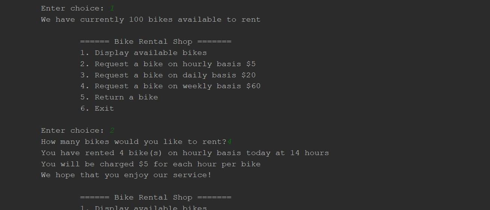

# Simple-bike-rental

app that allows customer to rent stocked bike(s), shows overall price, returns bike(s) to stock and calculates payment based on chosen rate

settings in BikeRent.py - current stock status, hourly/daily/weekly rates per bike

### To run the program
just run the main.py script and follow instructions given in command line

a rough look:

